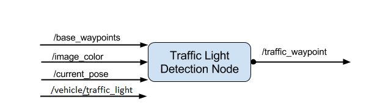

# CarND-CapStone Project
## Team: Lone Star Drivers
* Yingwei Yu: yingweiy@gmail.com
* Qiuhua Liu: sdflower@gmail.com
* Sylvain Chambon: sylvain.chambon@m4x.org
* Arman Khalighi: khalighi.ar9@gmail.com
* Adam Wybierala: adam.wybierala@gmail.com

This is the project repo for the final project of the Udacity Self-Driving Car Nanodegree: Programming a Real Self-Driving Car. 

# Project Notes
## Software Architecture 
For this project, we are writing ROS nodes to implement core functionality of the autonomous vehicle system. The following is the system architecture diagram that shows the ROS nodes and topics used in the project.  


Working as a team, we built the Waypoint Updater. Traffic Light Detection, DBW (drive-by-wire) controller ROS nodes for the autonomous vehicle system.  The Waypoint Loader, Waypoint Follower nodes were given by Udacity and the Obstacle Detection node is not needed for this project.  The final project will be tested on Carla, an autonomous Lincoln MKZ, at the Udacity test site in Palo Alto, California.      

## Waypoint Updater
The purpose of the `waypoint_updater` node is to update the target velocity property of each waypoint based on traffic light and obstacle detection data. As seen in the ROS graph below,  this node will subscribe to the `/base_waypoints`, `/current_pose`, `/obstacle_waypoint`, and `/traffic_waypoint` topics, and publish a list of waypoints ahead of the car with target velocities to the `/final_waypoints` topic. 


Following the project walkthrough, the `waypoint_updater` node was implemented in two steps, in the code `/ros/src/waypoint_updater/waypoint_updater.py`. 

The first step neglects the traffic lights and just publish the list of waypoints that are currently ahead of the vehicle. To do this, it subscribes to the topics
* `/base_waypoints` 
* `/current_pose` 

and publishes the list of 200 waypoints ahead of the vehicle to the topic  
* `/final_waypoints` 

Once the traffic light detection module works(to be described later) , the state of the traffic light was incorporated into the waypoint updater node.  If there are red lights ahead, we adjust the speed of the waypoints to slow the vehicle down and stop at the red light. For this, it subscribe to the topic

* `/traffic_waypoint`
 
 If there is no red lights detected in the distance that we care about, we just publish the waypoints as the first step. If there is a red traffic light that is in the range that we care about, the velocities of the waypoints leading up to the red light was updated following the walkthrough to ensure to bring the vehicle to a smooth and full stop. 
 The de-celeration module was implemented in the function `decelerate_waypoints` in `waypoint_updater.py`, where the speed was updated using the square root function of the distance between the vehicle and the waypoints:
 ```bash
  dist = self.distance(waypoints, i, stop_idx)
  vel = math.sqrt(2 * MAX_DECEL * dist) 
 ```
  
## DBW Controller
Once the waypoints message was published to the topic `/final_waypoints`, the vehicle's waypoint follower will publish twist commands to the `/twist_cmd` topic. For this, the drive-by-wire node by implemented in the function `dbw_node.py`, both following the project walkthrough. It subscribes to the topics  
* `/twist_cmd`
* `/current_velocity`
* `/vehicle/dbw_enabled`

to get the appropriate throttle, brake, and steering commands and publishes the commands to the following topics:
* `/vehicle/throttle_cmd` 
* `/vehicle/brake_cmd` 
* `/vehicle/steering_cmd` 

as shown in the following ROS graph:


The message publishers and the subscribers was implemented in the file `dbw_node.py` and the vehicle control using PID controller and a low pass filter to filter out the high frequency noise for the acceleration was implemented in the file `twist_controller.py`. 

Because the Autoware code used in Udacity does not re-compute the trajectory until the vehicle passes certain distance or angle away from the trajectory of the waypoints, the vehicle will wander a little bit within the lane. To fix this, the waypoint follower CPP code `ros/src/waypoint_follower/src/pure_pursuit_core.cpp`  was updated so that it follows the wayppoints all the time.      

## Traffic Light Detection
The traffic lights detection node subscribes to four topics:
* `/base_waypoints `
* `/current_pose `
* `/image_color` 
* `/vehicle/traffic_lights` 

and publishes the index of the waypoint for nearest upcoming red light's stop line to the topic:

* `/traffic_waypoint`

as shown in the ROS graph



The `process_traffic_lights` method in the file `tl_detector.py` was updated to find the nearest visible traffic light ahead of the vehicle using the `get_closest_waypoint` function.  

To use the camera image date to classify the color of the traffic light, we explored two different approaches. 

The first one is a quick implementation that simply detects the red color pixels in the camera images using Python cv2 package. To do this, the original images were transformed into HSV color space and the number of pixels with the red color was counted and a threshold was applied to it to detect whether the image has the red lights or not.  This method works well for the simulator and the vehicle was able to stop at the red light.

The second method implemented a deep learning classifier using the Bosch traffic light dataset to to classify the entire image as containing either a red light, yellow light, green light, or no light.
 
Details on the second method....

# Installation

Please use **one** of the two installation options, either native **or** docker installation.

### Native Installation

* Be sure that your workstation is running Ubuntu 16.04 Xenial Xerus or Ubuntu 14.04 Trusty Tahir. [Ubuntu downloads can be found here](https://www.ubuntu.com/download/desktop).
* If using a Virtual Machine to install Ubuntu, use the following configuration as minimum:
  * 2 CPU
  * 2 GB system memory
  * 25 GB of free hard drive space

  The Udacity provided virtual machine has ROS and Dataspeed DBW already installed, so you can skip the next two steps if you are using this.

* Follow these instructions to install ROS
  * [ROS Kinetic](http://wiki.ros.org/kinetic/Installation/Ubuntu) if you have Ubuntu 16.04.
  * [ROS Indigo](http://wiki.ros.org/indigo/Installation/Ubuntu) if you have Ubuntu 14.04.
* [Dataspeed DBW](https://bitbucket.org/DataspeedInc/dbw_mkz_ros)
  * Use this option to install the SDK on a workstation that already has ROS installed: [One Line SDK Install (binary)](https://bitbucket.org/DataspeedInc/dbw_mkz_ros/src/81e63fcc335d7b64139d7482017d6a97b405e250/ROS_SETUP.md?fileviewer=file-view-default)
* Download the [Udacity Simulator](https://github.com/udacity/CarND-Capstone/releases).

### Docker Installation
[Install Docker](https://docs.docker.com/engine/installation/)

Build the docker container
```bash
docker build . -t capstone
```

Run the docker file
```bash
docker run -p 4567:4567 -v $PWD:/capstone -v /tmp/log:/root/.ros/ --rm -it capstone
```

### Port Forwarding
To set up port forwarding, please refer to the [instructions from term 2](https://classroom.udacity.com/nanodegrees/nd013/parts/40f38239-66b6-46ec-ae68-03afd8a601c8/modules/0949fca6-b379-42af-a919-ee50aa304e6a/lessons/f758c44c-5e40-4e01-93b5-1a82aa4e044f/concepts/16cf4a78-4fc7-49e1-8621-3450ca938b77)

### Usage

1. Clone the project repository
```bash
git clone https://github.com/udacity/CarND-Capstone.git
```

2. Install python dependencies
```bash
cd CarND-Capstone
pip install -r requirements.txt
```
3. Make and run styx
```bash
cd ros
catkin_make
source devel/setup.sh
roslaunch launch/styx.launch
```
4. Run the simulator

### Real world testing
1. Download [training bag](https://s3-us-west-1.amazonaws.com/udacity-selfdrivingcar/traffic_light_bag_file.zip) that was recorded on the Udacity self-driving car.
2. Unzip the file
```bash
unzip traffic_light_bag_file.zip
```
3. Play the bag file
```bash
rosbag play -l traffic_light_bag_file/traffic_light_training.bag
```
4. Launch your project in site mode
```bash
cd CarND-Capstone/ros
roslaunch launch/site.launch
```
5. Confirm that traffic light detection works on real life images
